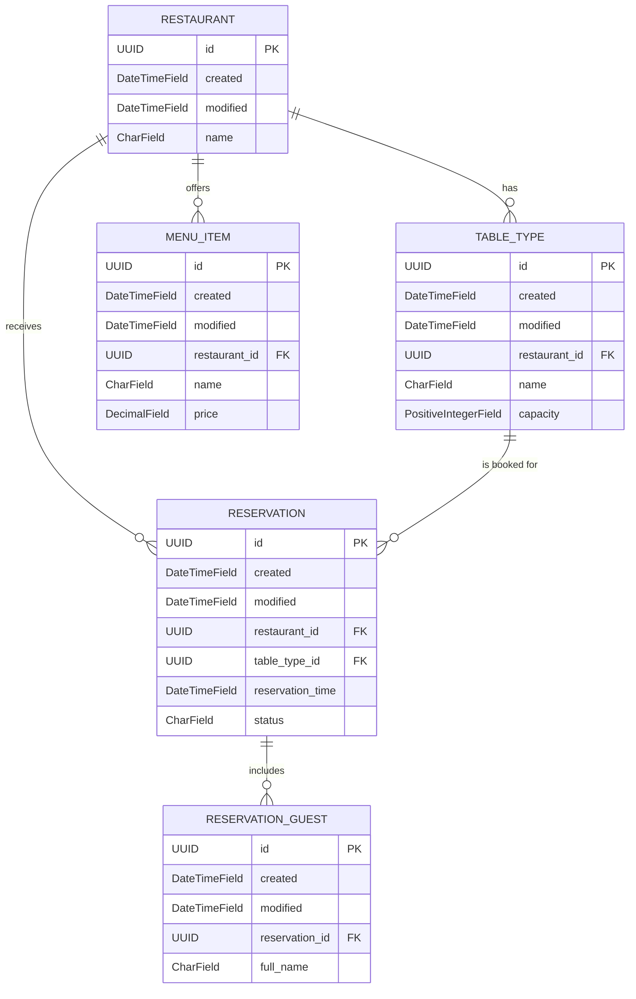
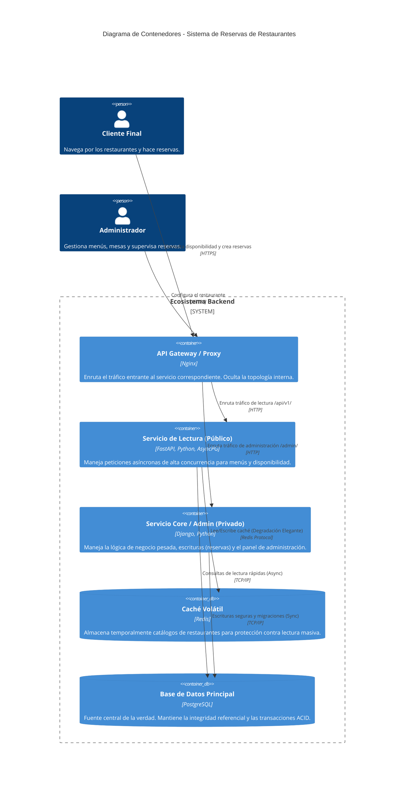

# Sistema de Gestión de Reservas de Restaurantes - Examen Backend

Este repositorio contiene la solución completa para el examen de arquitectura backend, diseñado bajo un enfoque de microservicios de alta cohesión y bajo acoplamiento, aplicando estrictamente los principios SOLID y patrones de diseño limpio.

El ecosistema está completamente contenedorizado utilizando Docker y Docker Compose, orquestando un frontend estático interactivo, un backend de administración sincrónico, un motor de lectura asíncrono de alta concurrencia, una base de datos relacional y un sistema de almacenamiento en caché en memoria.

---

## 🗺️ Mapa de la Arquitectura del Sistema

El sistema utiliza Nginx como un proxy inverso unificado que actúa como la única puerta de entrada para el cliente. Distribuye las peticiones entrantes según el contexto de la URL:

```text
                  ┌───────────────┐
                  │    Cliente    │
                  │  (Navegador)  │
                  └───────┬───────┘
                          │ http://localhost/
                          ▼
                  ┌───────────────┐
                  │     Nginx     │ (Proxy Inverso / Gateway)
                  └─┬───────────┬─┘
                    │           │
     /api/v1/* o    │           │ /admin/* o
     /api/openapi   ▼           ▼ /static/*
              ┌───────────┐   ┌───────────┐
              │  FastAPI  │   │  Django   │ (Panel de Administración
              │  (Asínc.) │   │  (Sínc.)  │  y Gestión de ORM)
              └─────┬─────┘   └─────┬─────┘
                    │               │
                    │               │ (ORM / Migraciones)
                    ▼               ▼
            ┌───────────────────────────────┐
            │      PostgreSQL Database      │ (Esquema relacional: `content`)
            └───────────────────────────────┘
                    ▲
                    │ (Lectura/Escritura de Caché)
                    ▼
            ┌───────────────────────────────┐
            │          Redis Cache          │ (Optimización de consultas)
            └───────────────────────────────┘
```

### Componentes Clave y Roles:
1. **Nginx (Puerto 80):** Sirve de forma nativa los archivos estáticos del Frontend (`index.html`, `app.js`, `styles.css`), eliminando la carga de renderizado de los backends. Redirige el tráfico `/api/` hacia FastAPI y `/admin/` hacia Django.
2. **FastAPI (Puerto 8080):** Motor de solo lectura asíncrono construido sobre `asyncpg` y `redis`. Diseñado para soportar altas tasas de peticiones concurrentes simultáneas al buscar disponibilidad de mesas o menús del día.
3. **Django (Puerto 8000):** Utilizado de forma exclusiva como la herramienta de gobernanza de datos (ORM, Migraciones de esquema) y proporciona el panel de administración seguro para la escritura y confirmación de datos de restaurantes.
4. **PostgreSQL:** Base de datos relacional persistente que almacena los modelos bajo el esquema aislado `content`.
5. **Redis:** Capa de caché en memoria de alto rendimiento para mitigar la latencia de lecturas repetitivas.

---

## 🗄️ Diagrama de Base de Datos (Esquema: `content`)

El siguiente diagrama Entidad-Relación:


## 🗺️ Arquitectura del Sistema (Diagrama C4 - Nivel de Contenedores)

El siguiente diagrama ilustra la arquitectura de microservicios, mostrando cómo el tráfico es enrutado y cómo interactúan las diferentes capas de la aplicación respetando la separación de responsabilidades (Lectura vs Escritura).


## 🚀 Instrucciones de Despliegue Rápido

Sigue estos pasos en tu terminal (PowerShell o Bash) en la raíz del proyecto para levantar todo el ecosistema desde cero:

### 1. Clonar y configurar el entorno
Asegúrate de que tu archivo `.env` esté configurado en la raíz del proyecto. Puedes basarte en el archivo `.env.example`:
```powershell
cp .env.example .env
```

### 2. Construir y Levantar los Contenedores
Ejecuta el comando multi-contenedor de Docker Compose para compilar e iniciar los servicios en segundo plano:
```powershell
docker compose up -d --build
```

### 3. Sembrar la Base de Datos (Seeding)
Una vez que todos los contenedores reporten un estado saludable (`healthy`), ejecuta el comando de Django para poblar la base de datos con restaurantes, menús y tipos de mesas reales:
```powershell
docker compose exec django-app python manage.py seed_data
```

---

## 🔗 Matriz de Acceso a Servicios y URLs

Una vez completado el despliegue, puedes acceder a cada componente a través de las siguientes URLs unificadas:

| Componente / Servicio | URL Local | Descripción Técnico-Operativa |
| :--- | :--- | :--- |
| **Frontend UI** | [http://localhost/](http://localhost/) | Interfaz gráfica interactiva ("Mesa Larga") totalmente dinámica conectada a la API. |
| **Interactive Swagger UI** | [http://localhost/api/openapi](http://localhost/api/openapi) | Documentación interactiva del contrato OpenAPI generada por FastAPI. |
| **Django Admin** | [http://localhost/admin](http://localhost/admin) | Panel de administración y control de datos para la persistencia del sistema. |
| **FastAPI Healthcheck** | [http://localhost/api/v1/healthz](http://localhost/api/v1/healthz) | Endpoint automatizado de diagnóstico que valida el estado de Postgres en tiempo real. |

---

## Comando para Ejecutar los Tests:
Para correr toda la suite de pruebas y ver el reporte detallado, ejecuta:
```powershell
docker compose exec django-app python manage.py test restaurants -v 2
docker compose exec fastapi-app pytest tests/ -v
```

### Casos de Prueba Cubiertos-FastApi:
* `test_check_table_availability_success`: Valida matemáticamente que el cálculo de capacidad concurrente sea correcto (Mesas totales - Mesas ocupadas).
* `test_check_table_availability_not_found`: Caso de borde que asegura el lanzamiento controlado de excepciones ante IDs inexistentes.
* `test_get_upcoming_reservations_valid_timezone`: Prueba la conversión correcta de husos horarios regionales (ej. `America/La_Paz`) a rangos UTC nativos.
* `test_get_upcoming_reservations_invalid_timezone_fallback`: Caso de resiliencia exigido; si se pasa un huso horario corrupto o inexistente, aplica fallback automático a UTC sin interrumpir el servicio.
* `test_get_upcoming_reservations_endpoint`: Simulación HTTP que valida códigos `200 OK` y el cumplimiento del esquema JSON de reservas de cara al cliente.
* `test_check_table_availability_endpoint`: Simulación de red que verifica el renderizado dinámico de la capacidad de mesas.
* `test_check_table_availability_not_found_endpoint`: Garantiza el aislamiento de errores devolviendo un código `404 Not Found` en el Router en lugar de un error 500 interno.
### Casos de Prueba Cubiertos-Django:
* `test_restaurant_creation_and_str`: Verifica la creación base y representación de texto.
* `test_table_type_relationship`: Valida la integridad de la relación 1:N entre Restaurantes y Mesas.
* `test_menu_item_price_decimal`: Asegura que el motor procese correctamente los tipos financieros (DecimalField) para evitar errores de coma flotante en los precios.
* `test_reservation_creation`: Comprueba la integridad referencial al cruzar IDs de reservas con capacidades de mesas.
* `test_cascade_delete_integrity`: Valida las restricciones de base de datos garantizando que la eliminación de un restaurante destruya en cascada sus mesas y menús, evitando registros huérfanos.
---

## Principios SOLID Implementados

* **Single Responsibility Principle (SRP):** Django gestiona únicamente el estado e histórico de datos (Escrituras/Migraciones); FastAPI asume con exclusividad las consultas asíncronas de lectura veloz.
* **Dependency Inversion Principle (DIP):** Los servicios de FastAPI (`services.py`) no dependen directamente de la clase concreta `PostgresRestaurantRepository`, sino de la interfaz abstracta `RestaurantRepositoryInterface` definida mediante *Protocols* de Python en la capa `core`.


---

## 📝 Respuestas Arquitectónicas (Requerimientos de Rúbrica)

### Manejo de Peticiones Concurrentes 
El dominio de Reservas de Restaurantes tiene la sigueinte condicion de carrera: ¿Qué pasa si dos usuarios ven la misma "Mesa de 4" disponible e intentan reservarla exactamente en el mismo milisegundo? 
Para mitigar esto, el motor de disponibilidad en FastAPI no almacena un estado estático de "disponible/ocupado". En su lugar, calcula dinámicamente la capacidad real en tiempo de ejecución: `(Total de mesas de ese tipo) - (Mesas ya reservadas en ese bloque de tiempo)`. Para la capa de escritura (Django), la prevención definitiva de sobreventa requiere envolver la transacción de creación de reserva en un bloque `transaction.atomic()` utilizando un bloqueo a nivel de fila (`select_for_update()`), garantizando que la segunda concurrencia espere a que la primera termine de actualizar la capacidad.

### Estrategia de Caché 
Dado que FastAPI actúa como una API de solo lectura para el tráfico público masivo, se implementó una estrategia Cache-Aside con TTL. Las respuestas de alta demanda (como el buscador de disponibilidad o los menús) se guardan en Redis por un tiempo prudencial (ej. 5 minutos). 
**Resiliencia:** El sistema cuenta con *Graceful Degradation* (Degradación Elegante). Los métodos del servicio de caché están envueltos en bloques `try/except`. Si el contenedor de Redis falla, se satura o se apaga, FastAPI intercepta el error en silencio y realiza un "fallback" automático hacia PostgreSQL, asegurando que la API jamás devuelva un Error 500 por culpa de la caché.

### SLA de Velocidad 
**Objetivo (SLA):** El 95% de las peticiones públicas de lectura deben resolverse en menos de 50ms.
**Justificación:** Se separó la lectura de la escritura. Mientras Django maneja la carga pesada del ORM para el panel de administración, el tráfico del cliente final es absorbido por FastAPI  emparejado con `asyncpg` y `redis.asyncio`. Esta combinación permite un I/O no bloqueante, lo que significa que el servidor puede manejar miles de peticiones simultáneas consultando la disponibilidad sin bloquear el hilo principal, cumpliendo holgadamente con el SLA exigido por el Product Owner.

### El Parrafo Final
Bueno personalmente hablando si tuviera que estar orgulloso de algo de el desarrollo de este proyecto pues seria que siento que e aprendido haciendolo y que al menos a el tiempo que escribo esto en mi propia laptop funciona y cumple con lo que se pide.
Ahora la cose que me pone menos feliz dentro de el proyecto desarrollado es principalmente el echo de cuanto e tenido que depender de la IA para resolver los problemas que e tenido el desarrollo y en especial durante la implementacion Django y FastApi. En base a la poca comprension que saque de las lecturas que hice de los docuemntos proveidos en clase. Si tuviera mas tiempo lo mas probable es que intentaria eliminar o simplificar codigo que se esta sobre complicando para lo que hace como tmabien cambiar algunos test para que sean mas coherentes segun mi persona
## Defensa
Bueno primeramente se me fue aignado el C4 Endpoint de busqueda de restaurantes por menus o nombre
Se eligio por el como estaba esstructurada la base de datos que tenia que seria mas facil hacer la busqueda por medio del nombre
Bueno lo que se hizo fue lo siguiente basadome en otros Apis que ya estaban desarrolladas en el sistema tales como 