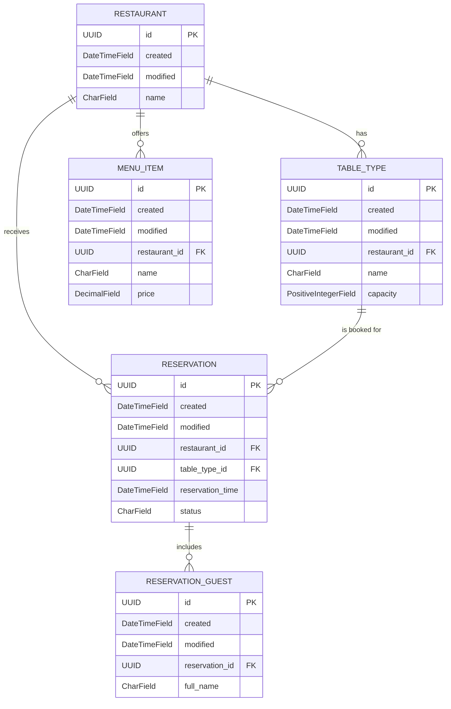

# Sistema de Gestión de Reservas de Restaurantes - Examen Backend

Este repositorio contiene la solución completa para el examen de arquitectura backend, diseñado bajo un enfoque de **microservicios de alta cohesión y bajo acoplamiento**, aplicando estrictamente los **principios SOLID** y patrones de diseño limpio.

El ecosistema está completamente contenedorizado utilizando **Docker** y **Docker Compose**, orquestando un frontend estático interactivo, un backend de administración sincrónico, un motor de lectura asíncrono de alta concurrencia, una base de datos relacional y un sistema de almacenamiento en caché en memoria.

---

## 🗺️ Mapa de la Arquitectura del Sistema

El sistema utiliza **Nginx** como un proxy inverso unificado que actúa como la única puerta de entrada (`Gateway`) para el cliente. Distribuye las peticiones entrantes según el contexto de la URL:

```text
                  ┌───────────────┐
                  │    Cliente    │
                  │  (Navegador)  │
                  └───────┬───────┘
                          │ http://localhost/
                          ▼
                  ┌───────────────┐
                  │     Nginx     │ (Proxy Inverso / Gateway)
                  └─┬───────────┬─┘
                    │           │
     /api/v1/* o    │           │ /admin/* o
     /api/openapi   ▼           ▼ /static/*
              ┌───────────┐   ┌───────────┐
              │  FastAPI  │   │  Django   │ (Panel de Administración
              │  (Asínc.) │   │  (Sínc.)  │  y Gestión de ORM)
              └─────┬─────┘   └─────┬─────┘
                    │               │
                    │               │ (ORM / Migraciones)
                    ▼               ▼
            ┌───────────────────────────────┐
            │      PostgreSQL Database      │ (Esquema relacional: `content`)
            └───────────────────────────────┘
                    ▲
                    │ (Lectura/Escritura de Caché)
                    ▼
            ┌───────────────────────────────┐
            │          Redis Cache          │ (Optimización de consultas)
            └───────────────────────────────┘
```

### Componentes Clave y Roles:
1. **Nginx (Puerto 80):** Sirve de forma nativa los archivos estáticos del Frontend (`index.html`, `app.js`, `styles.css`), eliminando la carga de renderizado de los backends. Redirige el tráfico `/api/` hacia FastAPI y `/admin/` hacia Django.
2. **FastAPI (Puerto 8080):** Motor de **solo lectura asíncrono** construido sobre `asyncpg` y `redis`. Diseñado para soportar altas tasas de peticiones concurrentes simultáneas al buscar disponibilidad de mesas o menús del día.
3. **Django (Puerto 8000):** Utilizado de forma exclusiva como la herramienta de gobernanza de datos (ORM, Migraciones de esquema) y proporciona el panel de administración seguro para la escritura y confirmación de datos de restaurantes.
4. **PostgreSQL:** Base de datos relacional persistente que almacena los modelos bajo el esquema aislado `content`.
5. **Redis:** Capa de caché en memoria de alto rendimiento para mitigar la latencia de lecturas repetitivas.

---

## 🗄️ Diagrama de Base de Datos (Esquema: `content`)

El siguiente diagrama Entidad-Relación:



## 🚀 Instrucciones de Despliegue Rápido

Sigue estos pasos en tu terminal (PowerShell o Bash) en la raíz del proyecto para levantar todo el ecosistema desde cero:

### 1. Clonar y configurar el entorno
Asegúrate de que tu archivo `.env` esté configurado en la raíz del proyecto. Puedes basarte en el archivo `.env.example`:
```powershell
cp .env.example .env
```

### 2. Construir y Levantar los Contenedores
Ejecuta el comando multi-contenedor de Docker Compose para compilar e iniciar los servicios en segundo plano:
```powershell
docker compose up -d --build
```

### 3. Sembrar la Base de Datos (Seeding)
Una vez que todos los contenedores reporten un estado saludable (`healthy`), ejecuta el comando de Django para poblar la base de datos con restaurantes, menús y tipos de mesas reales:
```powershell
docker compose exec django-app python manage.py seed_data
```

---

## 🔗 Matriz de Acceso a Servicios y URLs

Una vez completado el despliegue, puedes acceder a cada componente a través de las siguientes URLs unificadas:

| Componente / Servicio | URL Local | Descripción Técnico-Operativa |
| :--- | :--- | :--- |
| **Frontend UI** | [http://localhost/](http://localhost/) | Interfaz gráfica interactiva ("Mesa Larga") totalmente dinámica conectada a la API. |
| **Interactive Swagger UI** | [http://localhost/api/openapi](http://localhost/api/openapi) | Documentación interactiva del contrato OpenAPI generada por FastAPI. |
| **Django Admin** | [http://localhost/admin](http://localhost/admin) | Panel de administración y control de datos para la persistencia del sistema. |
| **FastAPI Healthcheck** | [http://localhost/api/v1/healthz](http://localhost/api/v1/healthz) | Endpoint automatizado de diagnóstico que valida el estado de Postgres en tiempo real. |

---

## Suite de Testing Automatizado

Siguiendo las directrices de diseño robusto, el backend de FastAPI cuenta con una suite completa de pruebas unitarias y de integración que validan de forma aislada la lógica algorítmica y la capa de red HTTP.

### Principios Aplicados en los Tests:
* **Inversión de Dependencias (SOLID - D):** Se inyectan dobles de prueba (`Mocks`) para el repositorio de Postgres y la infraestructura de Redis en `conftest.py`. Los tests corren instantáneamente sin tocar la base de datos real.
* **Testing Asíncrono:** Uso avanzado de `pytest-asyncio` e `httpx.ASGITransport` para simular llamadas concurrentes sobre el ciclo de eventos asíncronos de FastAPI.

### Comando para Ejecutar los Tests:
Para correr toda la suite de pruebas y ver el reporte detallado, ejecuta:
```powershell
docker compose exec fastapi-app pytest tests/ -v
```

### Casos de Prueba Cubiertos:
* `test_check_table_availability_success`: Valida matemáticamente que el cálculo de capacidad concurrente sea correcto (Mesas totales - Mesas ocupadas).
* `test_check_table_availability_not_found`: Caso de borde que asegura el lanzamiento controlado de excepciones ante IDs inexistentes.
* `test_get_upcoming_reservations_valid_timezone`: Prueba la conversión correcta de husos horarios regionales (ej. `America/La_Paz`) a rangos UTC nativos.
* `test_get_upcoming_reservations_invalid_timezone_fallback`: Caso de resiliencia exigido; si se pasa un huso horario corrupto o inexistente, aplica fallback automático a UTC sin interrumpir el servicio.
* `test_get_upcoming_reservations_endpoint`: Simulación HTTP que valida códigos `200 OK` y el cumplimiento del esquema JSON de reservas de cara al cliente.
* `test_check_table_availability_endpoint`: Simulación de red que verifica el renderizado dinámico de la capacidad de mesas.
* `test_check_table_availability_not_found_endpoint`: Garantiza el aislamiento de errores devolviendo un código `404 Not Found` en el Router en lugar de un error 500 interno.

---

## Principios SOLID Implementados

* **Single Responsibility Principle (SRP):** Django gestiona únicamente el estado e histórico de datos (Escrituras/Migraciones); FastAPI asume con exclusividad las consultas asíncronas de lectura veloz.
* **Dependency Inversion Principle (DIP):** Los servicios de FastAPI (`services.py`) no dependen directamente de la clase concreta `PostgresRestaurantRepository`, sino de la interfaz abstracta `RestaurantRepositoryInterface` definida mediante *Protocols* de Python en la capa `core`.
